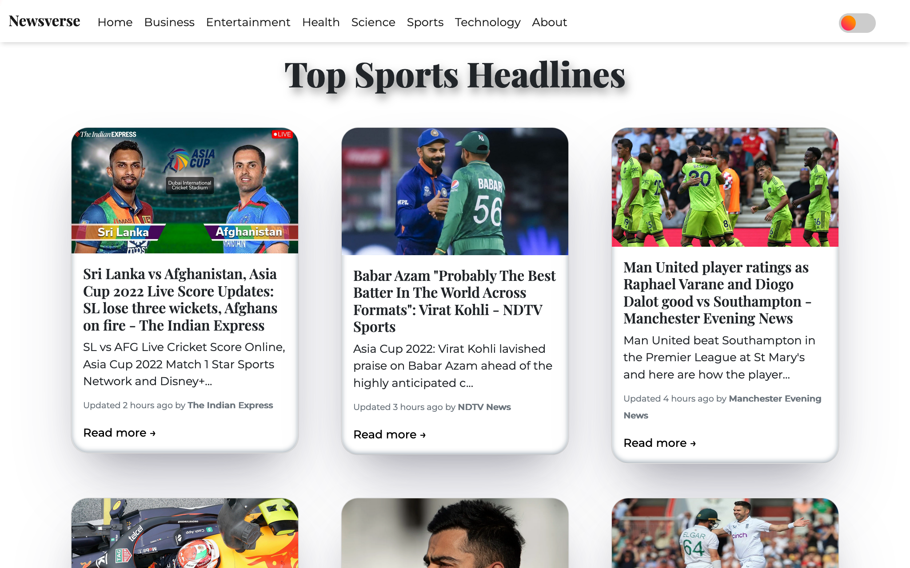
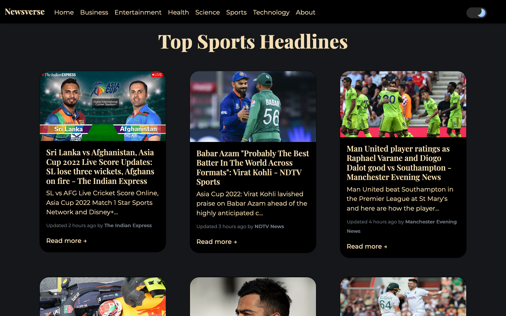
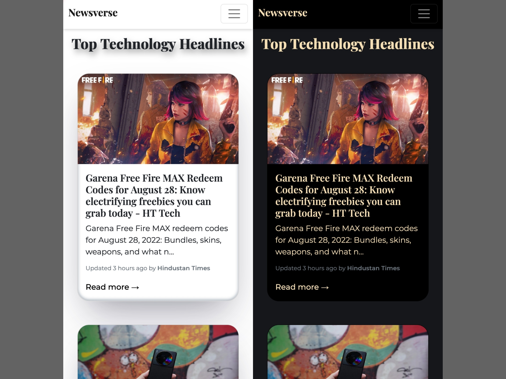

<h1 align="center">Newsverse</h1>
  

    Newsverse is a modern news app 🗞️ build on <a
						style={{ textDecoration: `none` }}
						href='https://reactjs.org/'
						target='_blank'
						rel='noopener noreferrer'
					>
						React
					</a> which uses <a
						style={{ textDecoration: `none` }}
						href='https://newsapi.org/'
						target='_blank'
						rel='noopener noreferrer'
					>
						NewsAPI
					</a>  to fetch top news headlines from the API 
  

## Images

Here are some snapshots 📸 of how my app looks ✨
 

 

 

 

### Built With

- [React](https://reactjs.org/)
- [React Router](https://reactrouter.com/en/main)
- [Bootstrap](https://getbootstrap.com/)
- [News API](https://newsapi.org/)
